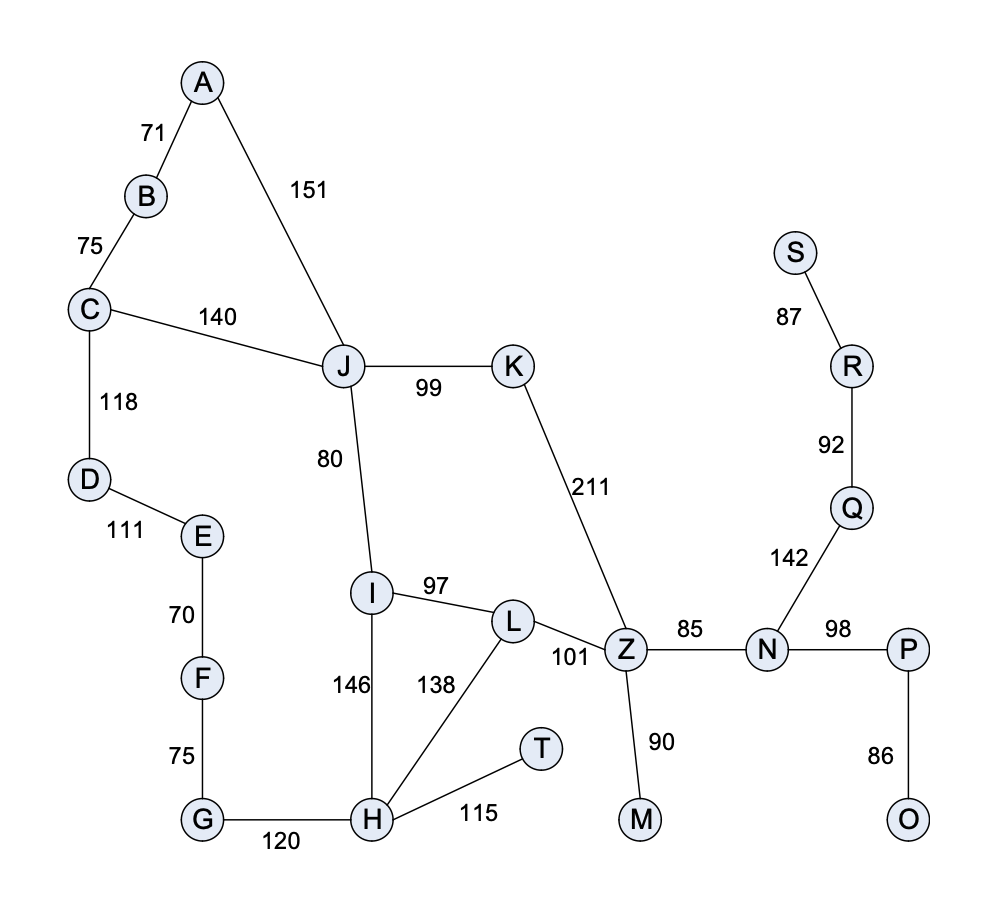

# Design Two Algorithms to Find a Shortest Path
-- CS526 Data Structures and Algorithms Final Project

## Problem Description

Your program reads two input files – (1) graph_input.txt and (2) direct_distance.txt.

The first input file contains structural information about the input graph. It is a textual representation of a graph. Your program must read the graph input file and store the information in an appropriate data structure. You can use any data structure to store the input graph.  

The second input file, named direct_distance.txt, has the direct distance from each node to the destination node Z. The direct distance from a node n to node Z is the distance measured along an imaginary straight line (or geographically straight line) from node n to node Z and is not necessarily the same as the sum of the weights of the edges connecting n to Z.

You are required to implement two heuristic algorithms that are described below. Both algorithms try to find a shortest path from a given input node to node Z using heuristic approaches. In a shortest path, a node may appear at most once (i.e., a node cannot appear twice or more in a path).

Note that these two heuristic algorithms do not always find a correct shortest path.

Both algorithms start with the given input node and iteratively determine the next node in a shortest path. In determining which node to choose as the next node, they use different heuristics.

Let w(n, v) be the weight of the edge between node n and node v. Let dd(v) be the direct distance from v to the destination node Z.

When choosing the next node from a current node n:

- Algorithm 1: Among all nodes v that are adjacent to the node n, choose the one with the smallest dd(v).

- Algorithm 2: Among all nodes v that are adjacent to the node n, choose the one for which w(n, v) + dd(v) is the smallest.

## Where input files are hardcoded

- “graph_input.txt” file path: Interface GraphAlgorithm.GRAPH_FILE_PATH (line 7)
- “direct_distance.txt” file path: Interface GraphAlgorithm.DIRECT_DISTANCE_FILE_PATCH (line 8)

## Construct Two Algorithms

### Step 1: Read and store information from two input files

#### Initialize variables
- HashMap<String, HashMap<String, Integer>>  graphMap
- HashMap<String, Integer>  directDistanceMap

#### Read “graph_input.txt” and use scanner to get the graph
- Store nodes as keys of graphMap
- Store HashMap, which has adjacent nodes as keys and corresponding weights as values, as values of graphMap

#### Read “direct_distance.txt” and use scanner to get the table
- Store nodes as keys of directDistanceMap
- Store distances to node Z as values of directDistanceMap

#### Validate the input file information and throw exceptions

### Step 2: prompt and validate the input of start node from user

- Prompt the user to input the start node
- Use scanner to get the input node
- Validate the input node

### Step 3: using two algorithms to find the shortest graph path

#### For both algorithms:
#### Initialize variables
- ArrayList <String>  sequenceNodes:
the sequence of all nodes initially included in a shortest path
- ArrayList <String>  shortestPath:
the final shortest path found by the algorithms
- Integer  shortestPathLength:
the length of the shortest path

#### Check if start node is in input graphs or not:
- If exists, initialize start node in sequenceNodes and shortestPath
- if not, exit the program

#### Check if start node equals Z:
- If equals, add start node in sequenceNodes and shortestPath, finished finding path
- If not, go to the next

#### Recursively choose the next node with two different algorithms
- Algorithm 1: dd(v)

Compare distances to node Z of all adjacent nodes except ones already in the path, choose the one with smallest distance as next node

- Algorithm 2: w(n, v) + dd(v)

Compare weight + distance of all adjacent nodes except ones already in the path, choose the one with smallest distance as next node

#### For both algorithms:
- If next node is Z:

Add next node in sequenceNodes and shortestPath, add weight to shortestPathLength, then finished

- If next node is found:

Add next node in sequenceNodes and shortestPath, add weight to shortestPathLength, then using next node as start node to recursively find next node

- If next node is null, dead road, do backtracking:

Add previous node again to sequenceNodes, remove next node from shortestPath, subtract weight just add from shortestPathLength, then find another next node

### Step 4: Print the result
- Print sequenceNodes and shortestPath in required format by using for loop
- Print shortestPathLength

## Major Data Structures used in Program

### ArrayList

ArrayList is a part of collection framework and is present in java.util package. It provides us with dynamic arrays in Java. I choose ArrayList to record the sequence of nodes initially included in shortest path and all the nodes finally included in the path. The reasons are as follows:

- Efficiency of adding and removing element at the end

For ArrayList, add() and remove() methods change an element at the end of the ArrayList, no element needs to be shifted, so the running time of adding and removing element are O(1). Moreover, the empirical result of the previous assignment shows that the efficiency of adding element: ArrayList > LinkedList > HashMap. ArrayList is fastest.

In the program, once the next node is chosen, it will be added in the path. If backtracking, the current node will be removed in the path. All adding and removing happen at the end of the path. Therefore, ArrayList is a good choice.

- Efficiency of iterating and getting element

For ArrayList, access the specified location directly by the index, so the running time of getting element is O(1).

In the program, once the shortest path is found, it will be printed through iterating. It is efficient to use the for loop in combination with a get() method to do that.

- Efficiency of resizing

ArrayList is dynamic, which means the size is increased automatically if there is no space for new element, and the amount of additional space is proportional to the current size. In the program, the number of nodes depends on the input graph file, so the size of storing space cannot be determined. ArrayList solves this problem.

### HashMap

HashMap<K, V> is a part of collection framework and is present in java.util package. It stores the data in (Key, Value) pairs, and the values can be accessed by the keys of another type. I choose HashMap to record the graph and table from the input files. The reasons are as follows:

- Efficiency of searching

For HashMap, get(key) method is used to retrieve or fetch the value mapped by a particular key, namely we can access a specified location directly by the key, the running time is O(1). Moreover, the empirical result of the previous assignment shows that the efficiency of search: HashMap > ArrayList > LinkedList. HashMap is fastest.

In the program, when the first node is input and validated, it will be used as the key to search for the adjacent nodes and corresponding weights that stored as the values. Then when determine the next node, we still need get() method. Therefore, it is efficient to use HashMap to locate nodes and retrieve information.
